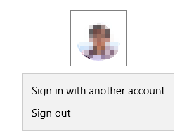

# AADLogin Control

The [AADLogin Control](https://docs.microsoft.com/dotnet/api/microsoft.toolkit.uwp.ui.controls.graph.aadlogin) leverages existing .NET login libraries to support basic AAD sign-in processes for Microsoft Graph.

## Syntax

```xaml
<Page ...
    xmlns:controls="using:Microsoft.Toolkit.Uwp.UI.Controls.Graph"/>

<controls:AADLogin x:Name="AADLogin1"
    View="PictureOnly"
    AllowSignInAsDifferentUser="True" />
```

## Example Image



## Properties

| Property | Type | Description |
| -- | -- | -- |
| ClientId | String | The guid the app is registered in [Application Registration Portal](https://apps.dev.microsoft.com/) |
| Scopes | String | Scopes required by the app |
| DefaultImage | BitmapImage | The default image displayed when no user is signed in |
| View | [ViewType](https://github.com/Microsoft/UWPCommunityToolkit/blob/master/Microsoft.Toolkit.Uwp.UI.Controls.Graph/ProfileCard/ViewType.cs) | The visual layout of the control. Default is `PictureOnly` |
| AllowSignInAsDifferentUser | Boolean | Whether or not the menu item for `Sign in as a different user` is enabled, default value is true |

## Methods

| Method | Return Type | Description |
| -- | -- | -- |
| SignInAsync | void | Method to call when to trigger the user signin.  UX of the control is updated if successful |
| SignOutAsync | void | Method to call to signout the currently signed on user |

## Events

| Method | Type | Description |
| -- | -- | -- |
| SignInCompleted | RoutedEventHandler | Occurs when one of the menu items in the control is clicked. |
| SignOutCompleted | RoutedEventHandler | Occurs when the user clicks on SignOut, or the SignOutAsync() method is called. Developers should clear any cached usage of GraphServiceClient objects they receive this event |

## Sample Code

[AADLogin Sample Page Source](https://github.com/Microsoft/UWPCommunityToolkit/tree/master/Microsoft.Toolkit.Uwp.SampleApp/SamplePages/AADLogin). You can see this in action in [UWP Community Toolkit Sample App](https://www.microsoft.com/store/apps/9NBLGGH4TLCQ).

## Default Template 

[AADLogin XAML File](https://github.com/Microsoft/UWPCommunityToolkit/blob/master/Microsoft.Toolkit.Uwp.UI.Controls.Graph/AADLogin/AADLogin.xaml) is the XAML template used in the toolkit for the default styling.

## Requirements

| Device family | Universal, 10.0.14393.0 or higher |
| -- | -- |
| Namespace | Microsoft.Toolkit.Uwp.UI.Controls.Graph |
| NuGet package | [Microsoft.Toolkit.Uwp.UI.Controls.Graph](https://www.nuget.org/packages/Microsoft.Toolkit.Uwp.UI.Controls.Graph/) |

## API

* [AADLogin source code](https://github.com/Microsoft/UWPCommunityToolkit/tree/master/Microsoft.Toolkit.Uwp.UI.Controls.Graph/AADLogin)
